<!-- ╔══════════════════════════════════════════════════════════════╗
     ║   README temático: Fate/Zero + Fate/stay night                ║
     ║   Conceito: "Unlimited Blade Works" — forjar código = forjar  ║
     ║   lâminas. Paleta: dourado (Saber) / azul / vermelho (Archer) ║
     ╚══════════════════════════════════════════════════════════════╝ -->

<!-- ===================== HEADER ===================== -->

 

<!-- ===================== SOCIAL ===================== -->
<!-- TODO Italo: troque a URL abaixo pelo seu LinkedIn real -->

&nbsp;

---

<!-- ===================== SOBRE ===================== -->
## About

Sou estudante de TI na **UFRPE**, me especializando em **back-end e dados**. Cada
projeto aqui é  um estudo que virou código de verdade.

---

<!-- ===================== SKILLS ===================== -->
## Skills

**Back-end**

**Front-end**

**DevOps**

---

<!-- ===================== PROJETOS ===================== -->
## Projetos

<table>
  <tr>
    <td width="50%" valign="top">
      <h3><a href="https://github.com/Italo-Fernando/fast_pulse">Fast Pulse</a></h3>
      
API REST de gerenciamento de usuários e tarefas, construída com FastAPI, PostgreSQL e Docker Compose. Migrations com Alembic e estrutura pronta pra deploy.

      
      
      
      
      
    </td>
    <td width="50%" valign="top">
      <h3><a href="https://github.com/Italo-Fernando/socketzinho">socketzinho</a></h3>
      
Chat anônimo com cara de terminal e comunicação full-duplex via WebSocket. Diário de estudo das formas de comunicação cliente↔servidor — com <a href="https://socketzinho.onrender.com/duplex">demo ao vivo</a>.

      
      
      
      
    </td>
  </tr>
  <tr>
    <td width="50%" valign="top">
      <h3><a href="https://github.com/Italo-Fernando/business_fetcher">Coletor de Empresas</a></h3>
      
App desktop que pesquisa empresas no Google Maps por setor e localização, exporta pra Excel/CSV e integra com Google Sheets. Roda em Linux e Windows.

      
      
      
    </td>
    <td width="50%" valign="top">
      <h3><a href="https://github.com/Italo-Fernando/CommitSentry">CommitSentry</a></h3>
      
Machine Learning aplicado à identificação de commits de risco — alterações com alta probabilidade de introduzir defeitos. Projeto de Reconhecimento de Padrões.

      
      
      
      
    </td>
  </tr>
</table>

---

<!-- ===================== STATS ===================== -->
## Github Stats

 

---

<!-- ===================== GIF / FOOTER ===================== -->

